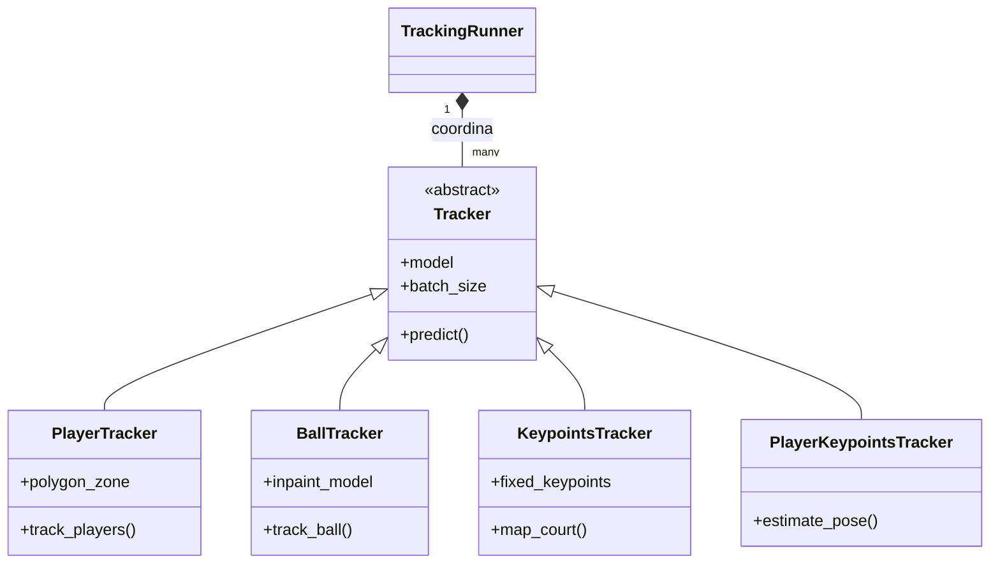

# Manual de Desarrollador: Padel Analytics

Este documento está orientado a programadores, ingenieros y mantenedores que vayan a interactuar con el código base del proyecto **Padel Analytics**, entender su arquitectura subyacente o expandir las funcionalidades de inteligencia artificial y computación algorítmica.

## 1. Arquitectura General del Sistema

El sistema es una aplicación monolítica escrita de manera modular en Python (v3.10+). El backend que realiza la inferencia computacionalmente pesada está desacoplado lógicamente (no por procesos) del frontend de la interfaz.

El núcleo de la tecnología orbita alrededor de:
*   **Modelos Base**: `Ultralytics YOLOv8` para pose y detección general. Redes neuronales específicas (`TrackNet` e `InpaintNet`) para tracking de bolas en secuencias deportivas veloces.
*   **Gestión del Flujo y Bounding Boxes**: Librería `Supervision` de Roboflow, clave en el *tracking*, persistencia de IDs, generación de *polygon-zones* (zonas de interés) y anotadores gráficos.
*   **Visualización Gui Web**: `Streamlit`, utilizado como frontend declarativo.


Existen dos vías de ejecución u *entry points*:
1.  **`app.py`**: Interfaz de Streamlit con control estado (`st.session_state`). Ideal para despliegue.
2.  **`main.py`**: Un script procedimental enfocado al testing por terminal (`CLI`). Muy útil para depurar sin la sobrecarga del entorno web de Streamlit. Utiliza un popup `cv2.imshow` vía OpenCV para seleccionar un polígono inicial haciendo clic si fuera necesario.

---

## 2. Estructura del Repositorio

El proyecto busca separar los algoritmos de Visión por Computador (`trackers`) del procesamiento de los datos extraídos (`analytics`).

```text
padel_analisis/
│
├── analytics/                  # Lógica para tratar los datos posteriores a la inferencia
│   ├── data_analytics.py       # Conversión de eventos a DataFrames pandas estructurados
│   ├── projected_court.py      # Cálculos de perspectiva 2D, homografías
│   └── shot_detector.py        # Algoritmos basados en física para detección de impactos
│
├── trackers/                   # Capas de IA e inferencia frame-a-frame
│   ├── ball_tracker/           # Módulos TrackNet / InpaintNet
│   ├── players_tracker/        # Detección general (YOLO)
│   ├── players_keypoints_tracker/ # Estimación de postura corporal (YOLO-Pose)
│   ├── keypoints_tracker/      # Detecciones específicas de elementos (red, líneas)
│   ├── tracker.py              # Clase abstracta/base para todos los Trackers
│   └── runner.py               # Orquestador: Bucle principal sobre los frames del vídeo
│
├── visualizations/             # Elementos gráficos
│   └── padel_court.py          # Definición en Plotly del rendering 2D de la pista
│
├── weights/                    # Modelos pre-entrenados .pt y binarios (Descarga separada)
├── config.py                   # Configuración global y paths cruzados
├── report_generator.py         # Orquestación y maquetación de la exportación a FPDF (PDF)
├── app.py                      # Punto de entrada Web
└── main.py                     # Punto de entrada y debug Terminal
```

---

## 3. Módulo de Tracking (`trackers/`)

Todo el flujo de vídeo delega bajo el concepto de Tracker. Cada tracker hereda de una abstracción base y debe implementar como mínimo la gestión iterativa o inferencial por lotes (*batch size*).

### `TrackingRunner` (`runner.py`)
Es el motor principal. Toma una lista de trackers instanciados (`[players, ball, keypoints, ...]`) y alimenta sus inferencias iterando sobre un "frame generator" (`sv.get_video_frames_generator`) obtenido vía `Supervision`. Su método `run()` engloba el bucle `for frame in pbar:`. Posteriormente renderiza los outputs sobre un generador de vídeo saliente, sincronizando todas las detecciones frame por frame.

### Trackers Específicos



*   **`PlayerTracker`**: Usa un modelo en YOLOv8 (detecta la clase "*persona*"). Incluye filtrado posicional mediante Polígonos de `Supervision` para evitar trackear al público o jueces que se encuentren fuera de las líneas limítrofes.
*   **`BallTracker`**: Integra dos modelos. TrackNet para capturar una estela y dar consistencia frente al "motion blur", e InpaintNet para reconstrucción local allí donde hay oclusiones intermitentes o bajo contraste (una pelota que cruza la línea blanca).
*   **`KeypointsTracker`**: Identifica los nodos de referencia fijos en la imagen (p. ej., esquinas de la pista y postes de la red). Esto es vital para "anclar" el sistema de coordenadas de la imagen al sistema de coordenadas de la proyección 2D.
*   **`PlayerKeypointsTracker`**: Añade esqueleto pose 2D al interior de las *bounding boxes* previas. La idea subyacente es permitir deducciones biomecánicas, como si el impacto es de derechas o revés basándose en sus extremidades.

---

## 4. Módulo de Analítica Computacional (`analytics/`)

Una vez superado el `runner.py`, los "bytes" se convierten en cinemática:

### Transformaciones Proyectivas (`projected_court.py`)
Dado un set de `Keypoints` del modelo que marcan las esquinas y los postes de la red en la pantalla (espacio de pantalla 2D), se calculan las matrices de transformación perspectiva (Homografías) usando OpenCV (`cv2.findHomography` / `cv2.perspectiveTransform`). Esto convierte cualquier píxel (x,y) de la pantalla en centímetros reales o proporcionales del mapa vectorizado (Plano cenital físico). Los pies de cada jugador (el `bbox` base media) se mapean mediante este componente.

### Clasificador Físico (`shot_detector.py`)
El corazón determinista que acompaña a la IA. Evalúa los datos `DataFrame` posprocesados:
1.  **Detección de Impacto**: Busca mínimos bruscos espaciales (`Vz` calculada si hay rebote de la bola, o alteraciones severas en el vector de la bola `dx, dy, dt`) que delatan un contacto o cambio repentino de aceleración.
2.  **Apropiación (Bounding Box colisionador)**: Si se marca un frame de impacto determinando su `pos_X, pos_Y`, evalúa espacialmente a qué jugador pertenece verificando si las coordenadas de la pelota intersectan el radio de acción/caja de un jugador.
3.  **Volea vs Fondo**: Clasifica según la posición de impacto relativa en la pista obtenida por la Homografía. Si la proyección 2D dicta que el impacto cae dentro de la zona colindante a la red, y antes de un bote local, se flagela como "Volea".

---

## 5. Control y Configuraciones (`config.py`)

Casi todo proyecto Machine Learning requiere afinación de hiperparámetros. En `padel_analisis`, están extraídos al patrón clásico *Constants file* (`config.py`):
*   **Rutas**: Centraliza los mapeos a los pesos dentro del *path* relativo o para persistencia en `./cache/` (útil en Docker).
*   `_BATCH_SIZE`: Fundamental para equilibrar consumo de VRAM (Memoria de Vídeo) y rapidez. Por defecto es `8` para un balance en GPUs modernas. **Aviso de Hardware Antiguo**: Si el script lanza un error fatal tipo `CUDA out of memory`, significa que los tensores del batch exceden la capacidad VRAM (típico en gráficas de 2GB o 4GB). En estos casos, se debe editar `config.py` y reducir el valor de `PLAYERS_TRACKER_BATCH_SIZE` y similares a `2` o `1`.
*   **Opciones Booleanas Generales**: Como `COLLECT_DATA`, vital tenerla en `True` si queremos que el output no solo dibuje, sino que levante los reportes analíticos para el DataFrame final.

---

## 6. Integración y Futuro Desarrollo (Extensibilidad)

Si deseas hacer un *fork* del proyecto TFG o introducir *pull requests* de mejora, estos son vectores propicios:

*   **Integración de Sistema Multi-Cámara (Dos Cámaras)**: Actualmente, el sistema padece de oclusiones naturales dada la perspectiva de una sola cámara (p. ej., un jugador tapa a su compañero o la bola se pierde tras la red). Una de las mayores mejoras futuras es implementar una arquitectura estéreo o de múltiples vistas.
    *   **¿Cómo implementarlo?**: Requerirá modificar `runner.py` para instanciar un "MultiTrackingRunner" que procese de forma sincrónica o semi-sincrónica dos flujos de vídeo (`cam1.mp4`, `cam2.mp4`). En lugar de proyectar a un 2D desde una homografía simple, se utilizarían técnicas de triangulación de cámaras estéreo o homografías combinadas ponderadas (si ambas ven la pista desde atrás en cada campo).
    *   **Problemas y Retos**:
        1.  *Sincronización*: Emparejar el fotograma `t=0` de dos cámaras independientes es complejo. Se necesitará un módulo de sincronización basado en audio (el sonido de un golpe fuerte) o picos de movimiento.
        2.  *Machine Identification (Re-ID)*: Saber que el "Jugador ID=1" en la cámara A es el mismo que el "Jugador ID=8" en la cámara B. Se necesitarán redes de *Appearance Feature Extraction* (Re-ID) para unificar la base de datos de los jugadores.
        3.  *Sobrecarga de Hardware (VRAM)*: Procesar YOLO y TrackNet por duplicado al mismo tiempo multiplicaría por dos el uso de memoria de vídeo (VRAM). Habría que refactorizar para procesar en serie o requerir infraestructura Cloud / GPUs más potentes.
*   **Persistencia y Bases de Datos**: El código actual emplea un archivo intermedio estático o `CSV`. Para llevar la app a un esquema de SaaS Cloud se deben inyectar adaptadores dentro de `analytics/data_analytics.py` en la salida final hacia un ORM (como SQLAlchemy, hacia PostgreSQL).
*   **Ampliación del Diccionario de Golpes**: En `shot_detector.py` la lógica de Volea y Fondo puede extenderse tomando en cuenta los *Player Keypoints* obtenidos. ¿Se podría estimar que fue un 'remate' (Smash) detectando que el punto de impacto de la bola está por encima o colindante al keypoint de la muñeca ascendente del jugador en el momento del impacto?.
*   **Mejora sobre Pistas Móviles**: El caso "Reutilizar detección de pista anterior" en el front-end asume cámara estática absoluta. Extender `ProjectedCourt` con recálculo dinámico basado en anclaje per-frame si la cámara "panea" ligeramente, abriría la puerta a utilizar streamings de partidos profesionales emitidos en televisión.
