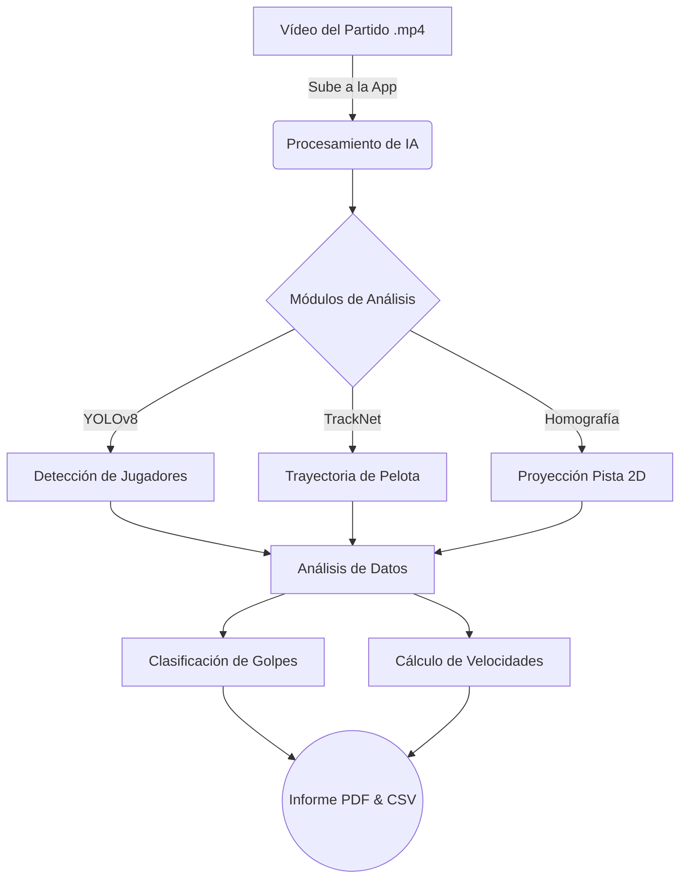

# Manual de Usuario: Padel Analytics

Bienvenido al Manual de Usuario de **Padel Analytics**, una herramienta avanzada de análisis de vídeo para pádel que utiliza Inteligencia Artificial para extraer métricas de rendimiento, trayectorias y estadísticas de juego a partir de tus grabaciones.

## 1. Introducción

### ¿Qué es Padel Analytics?
Padel Analytics es una aplicación diseñada para asistir a jugadores y entrenadores de pádel en el análisis táctico y de rendimiento. Mediante el simple uso de un vídeo de un partido (grabado con un teléfono móvil o cámara en trípode), el sistema extrae automáticamente información valiosa sin necesidad de sensores físicos o equipamiento costoso.



### Capacidades del Sistema
*   **Seguimiento de Jugadores y Pelota**: El sistema rastrea la posición de los jugadores y la trayectoria de la pelota usando modelos de *Computer Vision*.
*   **Mapa de Calor y Pista Virtual (2D)**: Proyecta la posición real de los jugadores en una pista virtual representada desde una vista cenital para analizar la cobertura de la pista.
*   **Velocidad de Bola**: Herramienta integrada para estimar la velocidad (km/h) de los golpes efectuados, tanto en juego normal como estimando el rebote.
*   **Clasificación de Golpes**: Detecta automáticamente los impactos y clasifica los golpes (ej. Voleas frente a golpes de fondo) analizando la velocidad de la bola y la posición en la pista.
*   **Generador de Informes (PDF y CSV)**: Posibilidad de descargar todos los datos crudos en Excel/CSV o exportar un informe completo y maquetado en PDF con resúmenes, gráficos de velocidad y cronología del partido.

---

## 2. Instalación y Arranque Rápido

Existen dos formas de instalar y ejecutar la aplicación. Recomendamos encarecidamente la opción con Docker por su simplicidad.

### Descarga Previa de Modelos de IA (Pesos)
**IMPORTANTE**: Antes de arrancar la aplicación por cualquier método, debes descargar los modelos pre-entrenados, ya que son muy pesados para incluirlos en el código fuente base.

1.  Descarga los archivos desde el enlace proporcionado por los administradores (ej. Google Drive).
2.  Extrae los archivos dentro de la carpeta `weights/` ubicada en la raíz del proyecto, respetando la estructura interna de carpetas (`weights/players_detection/`, etc.).

### Opción A: Despliegue con Docker (Recomendado)
Esta opción no requiere instalar Python ni configurar el entorno de desarrollo, y funciona en Windows, Mac y Linux.

1.  Instala [Docker Desktop](https://www.docker.com/products/docker-desktop/).
2.  Abre un terminal, navega a la carpeta del proyecto y ejecuta:
    ```bash
    docker-compose up --build
    ```
3.  Abre tu navegador web y visita: `http://localhost:8501`.

### Opción B: Instalación Local (Avanzado)
Si prefieres ejecución nativa, requieres Python 3.10+ y (opcionalmente) tarjeta gráfica NVIDIA para mayor velocidad.

1.  Abre el terminal en la carpeta del proyecto.
2.  (Opcional pero muy recomendado) Crea un entorno virtual: `conda create -n padel_analytics python=3.10` y actívalo `conda activate padel_analytics`.
3.  Instala las dependencias: `pip install -r requirements.txt`.
4.  Ejecuta la app: `streamlit run app.py`.
5.  Se abrirá automáticamente en tu navegador (`http://localhost:8501`).

---

## 3. Interfaz de Usuario (Web App)

La aplicación web cuenta con un panel central (Dashboard) diseñado para ser simple e intuitivo.

### Carga inicial de Datos
Al abrir la aplicación, te encontrarás con dos opciones principales para empezar a trabajar:
*   **Subir Video**: Usa el campo de texto o el botón para cargar un archivo `.mp4` o `.avi` con tu partido o entrenamiento.
*   **Cargar Reporte CSV existente**: Si ya has procesado un vídeo anteriormente, puedes subir aquí el archivo `padel_analytics_report.csv` generado, para saltarte el análisis y revisar directamente las estadísticas y generar PDFs instantáneamente.

### Opciones de Detección
*   **Reutilizar detección de pista anterior**: Casilla de verificación opcional.
    *   *¿Para qué sirve?* El sistema debe calibrar las esquinas de la pista para crear el mapa 2D. Si tienes varios vídeos que han sido grabados con la cámara en **exactamente la misma posición** (un trípode que no se ha movido), marca esta casilla. El sistema utilizará la calibración del primer vídeo, ahorrando tiempo y evitando recalibraciones erróneas.

### Ejecución
Pulsa **Subir y Procesar** tras configurar tus opciones. La aplicación mostrará una barra de progreso mientras analiza frame a frame (fotograma a fotograma). Esto puede tomar varios minutos dependiendo del hardware y la duración del vídeo.

---

## 4. Herramientas de Analítica

Una vez finalizado el procesamiento, se desplegarán múltiples paneles de análisis en la pantalla:

### Visualizador de Vídeo Procesado
El primer resultado es tu vídeo reproducido directamente en el navegador, pero enriquecido. Podrás ver sobreimpresionado en la imagen:
*   Las cajas delimitadoras (bounding boxes) alrededor de los jugadores detectados.
*   El rastro (trayectoria) de los últimos frames de la pelota durante el juego.
*   El esqueleto o pose corporal de los jugadores analizados.

### Datos Recolectados y Estadísticas
Bajo el vídeo, se despliegan varias secciones analíticas:
1.  **Dashboard de primeros datos**: Se muestran las primeras filas de la tabla de datos (`DataFrame`) extraídos. Útil para revisión técnica.
2.  **Gráfico de Velocidad**:
    *   Puedes alternar visualizaciones: Velocidad **Horizontal** (X), Velocidad **Vertical** (Y), o Velocidad **Absoluta**.
    *   Se muestra un gráfico interactivo con la evolución de la velocidad de los jugadores detectados a lo largo del tiempo del vídeo.
3.  **Clasificación de Golpes**:
    *   Automáticamente, la herramienta listará todos los impactos detectados, indicando en qué momento (tiempo del vídeo) se produjeron y su velocidad asociada.
    *   Aparecerá un **Timeline (Cronología)** en un gráfico tipo burbuja interactiva indicando el tipo de golpe deducido, por ejemplo, Volea o Golpe de Fondo.

### Herramienta Extra: Estimación Manual de Velocidad de la Bola
Existe un apartado desplegable llamado "Herramienta de Velocidad" para calcular la velocidad de un golpe manual (si se desea una verificación extra):
1.  Selecciona el primer fotograma (el instante previo al impacto o el instante del impacto).
2.  Selecciona el segundo fotograma (por ejemplo, cuando la bola golpea el suelo en el lado enemigo o cuando es recepcionada).
3.  Indica si el "Tipo de impacto" posterior fue en el *Suelo* o en la pala del *Jugador* rival.
4.  Activa "Considerar diferencia en altitud" para mayor precisión (mejora el cálculo de hipotenusa 3D).
5.  Pulsa "Calcular". El sistema devolverá la velocidad estimada en Km/h y mostrará una flecha representativa en el visor de la pista virtual (2D).

---

## 5. Generador de Informes (Exportación)

Bajo la cabecera "Datos Recolectados", encontrarás las funcionalidades, la parte útil para extraer los resultados del análisis y compartirlos.

1.  **Descargar Reporte (CSV)**: Botón para obtener el archivo `padel_analytics_report.csv`. Guárdalo. Este es tu archivo de "guardado" que te permitirá revisar el vídeo en el futuro sin tener que procesarlo otra vez de cero. Además es útil para analizarlo por tu cuenta usando Excel.
2.  **Descargar Video Procesado**: Obtén el vídeo `.mp4` enriquecido con los gráficos mostrados en pantalla (cajas, esqueleto, trayectorias) para tu disfrute o para compartir con alumnos.
3.  **📊 Informe Profesional en PDF**: Este es el sistema de entrega final.
    *   Pulsa en **"Generar PDF de Rendimiento"**. El sistema recopilará todas las métricas, creará las gráficas visuales estáticas y las maquetará en un documento.
    *   Una vez aparezca el aviso verde ("¡Informe generado con éxito!"), aparecerá un segundo botón **"📥 Descargar PDF Final"**. Descárgalo y ábrelo para revisar tu resumen de rendimiento.

---

## 6. Resolución de Problemas Frecuentes (FAQ)

*   **Error: "¡Faltan archivos de pesos!" al iniciar**: No has colocado correctamente los modelos pre-entrenados en la carpeta `weights/`. Revisa la sección 2. Descarga de Pesos.
*   **El análisis va muy lento**: Ocurre si usas la Opción B (Local) en un ordenador sin aceleración por tarjeta gráfica o con una gráfica no compatible. Se recomienda recortar los vídeos a clips de 1 o 2 minutos (sólo los rallies concretos) antes de subirlos.
*   **Las estadísticas salen cruzadas en la pista**: La herramienta a veces se desorienta si la cámara no está en el centro de la pista y enfocando recta, sobre todo con el plano 2D. Lo ideal para grabaciones óptimas son cámaras montadas en los cristales de fondo a altura elevada, o laterales totalmente centrados.
*   **Se ha generado un PDF en blanco o con errores**: Puede ocurrir que el partido haya carecido del número suficiente de frames que contengan un impacto real y el clasificador no logre construir el gráfico de dispersión de golpes. Revisa si en el panel web el gráfico de "Cronología de golpes" tiene datos o está vacío.
